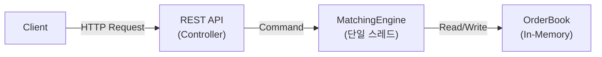
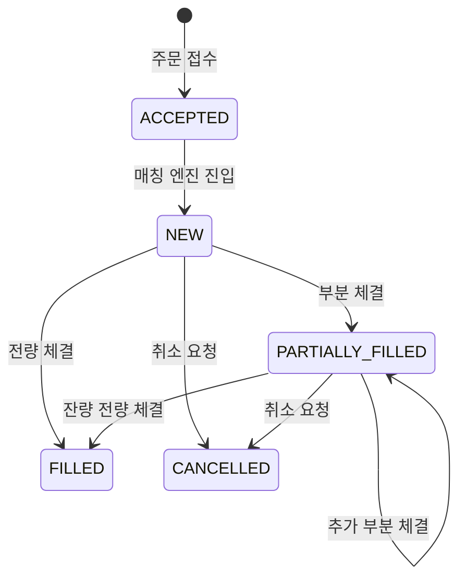

# Trading Exchange Engine - MVP Phase 1 기획서

## 1. 목표

가격-시간 우선 원칙(Price-Time Priority)을 따르는
단일 종목 인메모리 매칭 엔진을 구현한다.

웹 서비스 구현이 목적이 아니라,
매칭 로직의 정합성과 상태 전이의 정확성을 검증하는 것이 목표이다.

## 2. 범위

| 구분 | 항목 |
|------|------|
| **포함** | 단일 종목(TEST), 지정가(LIMIT) 주문, GTC 고정, 부분 체결, 주문 취소, 주문 상태 조회, 호가 조회, 단일 스레드 매칭 엔진 |
| **제외** | MARKET 주문, 다종목, 계좌 잔고 검증, DB 저장, WebSocket, 분산 환경, 성능 최적화 실험 |

## 3. 아키텍처



- 매칭 엔진은 단일 스레드에서 동작한다.
- 모든 상태 변경은 MatchingEngine 내부에서만 수행한다.
- Race Condition을 구조적으로 차단한다.

## 4. 도메인 모델

### Order

| 필드 | 타입 | 설명 |
|------|------|------|
| `orderId` | UUID | 주문 고유 식별자 |
| `side` | `Side` | BUY / SELL |
| `price` | long | 지정가 (≥ 1) |
| `quantity` | long | 초기 주문 수량 (≥ 1) |
| `remaining` | long | 미체결 잔량 (≥ 0) |
| `status` | `OrderStatus` | 현재 주문 상태 |

### OrderBook

| 필드 | 정렬 기준 | 설명 |
|------|----------|------|
| `bids` | 가격 내림차순 | 매수 주문 모음 |
| `asks` | 가격 오름차순 | 매도 주문 모음 |

동일 가격 레벨 내에서는 FIFO Queue로 관리한다.

## 5. 매칭 규칙

| 구분 | 체결 조건 | 체결 가격 | 체결 수량 |
|------|----------|----------|----------|
| BUY  | `bestAsk.price <= buy.price` 동안 반복 | Maker(ask) 가격 | `min(taker.remaining, maker.remaining)` |
| SELL | `bestBid.price >= sell.price` 동안 반복 | Maker(bid) 가격 | `min(taker.remaining, maker.remaining)` |

## 6. 상태 전이



- `FILLED`, `CANCELLED`는 종료 상태이며 이후 변경 불가.

## 7. API

### POST /orders — 주문 생성

**Request**
```json
{
  "side": "BUY",
  "price": 10000,
  "quantity": 5
}
```

**Response** `200 OK`
```json
{
  "orderId": "3f6e1b2a-...",
  "status": "ACCEPTED"
}
```

### DELETE /orders/{orderId} — 주문 취소

**Response** `200 OK`
```json
{
  "orderId": "3f6e1b2a-...",
  "status": "CANCELLED"
}
```

### GET /orders/{orderId} — 주문 조회

**Response** `200 OK`
```json
{
  "orderId": "3f6e1b2a-...",
  "side": "BUY",
  "price": 10000,
  "quantity": 5,
  "remaining": 2,
  "status": "PARTIALLY_FILLED"
}
```

### GET /book — 호가 조회

**Response** `200 OK`
```json
{
  "bids": [
    { "price": 10000, "quantity": 3 }
  ],
  "asks": [
    { "price": 10100, "quantity": 5 }
  ]
}
```

## 8. 정합성 목표

| 항목 | 목표 |
|------|------|
| 가격 우선 위반 | 0건 |
| 동일 가격 FIFO 위반 | 0건 |
| remaining 음수 발생 | 0건 |
| 잘못된 상태 전이 | 0건 |
| 시뮬레이션 테스트 | 10만 건 통과 |

## 9. 완료 기준

- 매칭 로직 단위 테스트 통과
- 상태 전이 테스트 통과
- 주문 생성 → 체결 → 조회 흐름 정상 동작
- 단일 프로세스에서 안정적으로 동작
