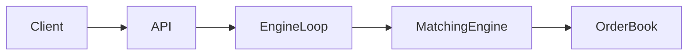
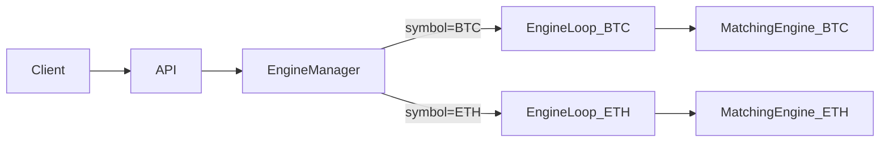
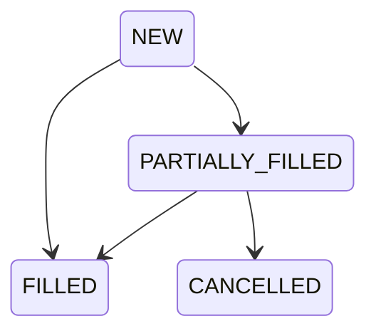

# Trading Exchange Engine - MVP Phase 2 기획서

---

## 1. 목표

MVP Phase 1에서 검증된 단일 종목 매칭 엔진을
**다종목 지원 구조로 확장하고**,
**MARKET 주문을 도입하여 실제 거래소에 근접한 형태로 발전시킨다.**

목표는 다음과 같다:

* 심볼별 독립 매칭 엔진 구조 확립
* MARKET 주문 처리 로직 추가
* 엔진 확장 가능 구조 확보
* 영속성 전략 명시적 설계

---

## 2. 범위

### 포함

| 구분        | 항목                 |
| --------- | ------------------ |
| 다종목 지원    | Symbol 기반 엔진 분리    |
| 주문 타입     | LIMIT + MARKET     |
| 심볼별 엔진 루프 | Thread-per-symbol  |
| 엔진 관리자    | EngineManager 도입   |
| 명시적 저장 전략 | 체결/취소 시 save 구조 확정 |

### 제외

| 구분                    | 항목 |
| --------------------- | -- |
| 계좌 잔고 검증              |    |
| WebSocket             |    |
| 분산 매칭                 |    |
| DB 영속 구현              |    |
| 고급 리스크 관리             |    |
| 주문 유형 확장 (IOC, FOK 등) |    |

---

## 3. 아키텍처 변경

### 3.1 기존 구조 (MVP1)



단일 종목, 단일 엔진.

---

### 3.2 Phase 2 구조



### 핵심 변화

* 심볼 단위로 매칭 엔진 분리
* 심볼마다 독립 OrderBook 보유
* 심볼별 단일 스레드 유지 (Race Condition 없음)

---

## 4. 도메인 확장

### 4.1 Symbol (Value Object)

| 필드    | 설명                   |
| ----- | -------------------- |
| value | "BTC", "ETH", "TEST" |

* null 불가
* 대문자 고정

---

### 4.2 Order 확장

| 필드        | 추가 여부          |
| --------- | -------------- |
| symbol    | 추가             |
| orderType | LIMIT / MARKET |

---

### 4.3 MARKET 주문의 Price 처리

**결정: `@Nullable Price` + 팩토리 메서드 분리**

`Optional<Price>`를 필드로 사용하는 방식은 Java 관례에 맞지 않고 OrderBook 정렬 등 도메인 전반에 Optional이 전파되는 문제가 있으므로 채택하지 않는다.

대신 MARKET 주문을 "가격이 없는 주문"이 아니라 **"가격 제약이 없는 주문"**으로 모델링한다.

```plaintext
Order.createLimit(side, symbol, price, quantity)  → price 필수 (non-null)
Order.createMarket(side, symbol, quantity)         → price = null
```

* `price` 필드는 `@Nullable`로 선언한다.
* 외부에서 `price`에 직접 접근하는 경로는 팩토리 메서드와 매칭 엔진 내부로 제한한다.
* `isPriceMatch()` 는 `taker.isMarket()` 이면 항상 `true`를 반환하여 price를 읽지 않는다.
* `Order` 생성자는 private/package-private으로 유지하고 팩토리 메서드가 유일한 진입점이다.

**도메인 불변식 (구현 필수 준수)**

1. **OrderBook에는 LIMIT 주문만 저장한다.** MARKET 주문은 절대 `orderBook.add()`를 호출하지 않는다.
2. **`Order.price` 접근은 LIMIT일 때만 허용한다.** `getLimitPriceOrThrow()` 같은 접근자를 두어 MARKET에서 호출 시 예외를 던진다. public `getPrice()`는 제거하거나 LIMIT 전용임을 명시한다.
3. **팩토리 검증:** `createLimit()`은 price null 시 예외, `createMarket()`은 price 전달 시 예외를 던져 생성 단계에서 혼용을 차단한다.

**API 응답에서의 price 처리**

MARKET 주문의 조회 응답(`GET /orders/{orderId}`)에서 `price` 필드는 `null`로 내려간다.
클라이언트는 `orderType`이 `MARKET`이면 `price`가 없음을 전제해야 한다.

> Phase 3 이후 규모가 커지면 `LimitOrder` / `MarketOrder` sealed 계층으로 분리를 검토한다.

---

## 5. EngineManager 설계

### 역할

* symbol → EngineContext 라우팅
* 없는 심볼 요청 시 예외
* 초기화 시 심볼 등록

```plaintext
EngineManager
 ├─ Map<Symbol, EngineContext>
       ├─ BlockingQueue<EngineCommand>
       ├─ EngineLoop
       ├─ EngineHandler
       ├─ MatchingEngine
       └─ OrderBook
```

---

### 5.1 Spring Bean 구조 변경

MVP1에서 `MatchingEngine`, `EngineHandler`, `EngineLoop`는 `@Component` 싱글턴이었다.
심볼별 독립 인스턴스가 필요하므로 다음과 같이 변경한다.

| 클래스             | MVP1         | MVP2                           |
| --------------- | ------------ | ------------------------------ |
| `EngineManager` | 없음           | `@Component` (Spring 관리)       |
| `MatchingEngine`| `@Component` | `@Component` 제거, 심볼별 수동 생성     |
| `EngineHandler` | `@Component` | `@Component` 제거, 심볼별 수동 생성     |
| `EngineLoop`    | `@Component` | `@Component` 제거, 심볼별 수동 생성     |
| `OrderBook`     | `@Bean`      | EngineContext 내부에서 심볼별 수동 생성   |
| `BlockingQueue` | `@Bean`      | EngineContext 내부에서 심볼별 수동 생성   |

**조립 방식 선택지 (구현 시 결정)**

* **직접 조립**: `EngineManager`가 `@PostConstruct`에서 `new`로 직접 생성. 구현이 단순하나 테스트에서 Mock 주입이 번거롭다.
* **EngineFactory 도입**: `EngineFactory`를 Spring Bean으로 두고, `createContext(symbol)` 내부에서 Spring이 제공하는 공유 의존성(`OrderRepository`, `OrderBookCache`)을 주입받아 조립. 테스트 용이성이 높고 Spring DI 장점을 유지한다.

Phase 2에서는 두 방식 모두 가능하나, EngineContext 생성에 공유 Spring Bean 의존성(Repository, EventPublisher 등)이 추가되는 시점에 EngineFactory 도입을 검토한다.

`@PreDestroy`에서 모든 EngineLoop를 순차 종료한다.

---

### 5.2 심볼 등록 방법 및 스레드 상한

`application.yml`에 지원 심볼을 명시한다.

```yaml
trading:
  symbols:
    - BTC
    - ETH
    - TEST
```

`EngineManager`는 해당 값을 `@ConfigurationProperties` 또는 `@Value`로 주입받아
초기화 시 심볼별 `EngineContext`를 생성한다.

**스레드 수 제약**

현재 구조는 심볼 수 = 스레드 수이다.
Phase 2에서는 **심볼 수를 소수(최대 20개 이하)로 전제**한다.
심볼이 수백 개 이상으로 늘어나는 경우 Thread-per-symbol 방식은 재설계가 필요하며, 이는 Phase 3 범위(virtual thread / worker pool)로 분류한다.

런타임 심볼 추가는 Phase 2 범위 외.

---

## 6. MARKET 주문 규칙

### 6.1 BUY MARKET

* bestAsk부터 순차 체결
* 가격 조건 없음
* 잔량 남으면 자동 CANCEL

### 6.2 SELL MARKET

* bestBid부터 순차 체결
* 가격 조건 없음
* 잔량 남으면 자동 CANCEL

---

### 6.3 상태 전이 추가



MARKET 주문은:

* 체결 완료 → FILLED
* 유동성 부족 → PARTIALLY_FILLED 후 CANCELLED

---

### 6.4 cancel 경로 구분

MARKET 주문의 자동 취소와 LIMIT 주문의 외부 취소는 경로가 다르다.

| 구분              | 경로                                               |
| --------------- | ------------------------------------------------ |
| LIMIT 외부 취소     | `cancelOrder(orderId)` → 오더북 제거 → `order.cancel()` |
| MARKET 잔량 자동 취소 | `placeMarketOrder()` 내부에서 직접 `taker.cancel()`     |

MARKET 잔량 취소는 오더북에 등록된 적이 없으므로 `orderBook.remove()`를 호출하지 않는다.
`cancelOrder(orderId)`는 LIMIT 전용으로 유지한다.

---

## 7. API 명세

### 7.1 엔드포인트

| 메서드      | 경로                        | 설명                    |
| -------- | ------------------------- | --------------------- |
| `POST`   | `/orders`                 | 주문 제출 (body에 symbol 포함) |
| `DELETE` | `/orders/{orderId}`       | LIMIT 주문 취소           |
| `GET`    | `/orders/{orderId}`       | 주문 단건 조회              |
| `GET`    | `/orderbook/{symbol}`     | 심볼별 호가창 조회            |

**경로 설계 의도**

* 주문 명령(제출/취소/조회)은 `/orders` 루트로 통일한다.
* 호가창은 주문 명령과 성격이 다른 **조회 전용 리소스**이므로 `/orderbook` 별도 루트로 분리한다.

### 7.2 주문 제출 요청 body

```json
{
  "symbol":    "BTC",
  "side":      "BUY",
  "orderType": "LIMIT",
  "price":     50000,
  "quantity":  10
}
```

* `orderType`이 `MARKET`이면 `price` 필드는 무시한다.
* 응답은 Phase 1과 동일하게 `202 ACCEPTED` + orderId. 체결 결과는 `GET /orders/{orderId}` 폴링으로 확인한다.
* 지원하지 않는 `symbol`이면 `400 Bad Request` + errorCode `UNSUPPORTED_SYMBOL`을 반환한다. Phase 2에서 지원 심볼은 yml에 고정된다.

### 7.3 에러 코드 체계

`DELETE /orders/{orderId}` 호출 시 상태에 따라 아래와 같이 응답한다.

| HTTP 상태 | errorCode                | 원인                          |
| ------- | ------------------------ | --------------------------- |
| `404`   | `ORDER_NOT_FOUND`        | orderId가 존재하지 않음            |
| `409`   | `ORDER_NOT_CANCELLABLE`  | MARKET 주문이라 외부 취소 불가        |
| `409`   | `ORDER_ALREADY_FINALIZED`| 이미 FILLED 또는 CANCELLED 상태   |

> 405(Method Not Allowed)는 해당 엔드포인트가 DELETE를 전혀 지원하지 않는다는 의미이므로 부적절하다.
> LIMIT에는 DELETE가 유효하고 특정 상태/유형에서만 충돌이 발생하므로 **409 Conflict**가 의미상 정확하다.
> 클라이언트는 errorCode로 원인을 분기하여 재시도 여부나 UX 처리를 결정한다.

### 7.4 주문 조회 (orderId 기반)

`orderId`는 전역 UUID이므로 symbol 없이 조회 가능하다.
`OrderRepository`는 `Map<OrderId, Order>` 구조로 글로벌 인덱스를 이미 보유한다.

---

## 8. 매칭 로직 확장

### 8.1 EngineHandler 분기

`EngineCommand.PlaceOrder`를 수신했을 때 `orderType`으로 분기한다.

```pseudo
switch order.orderType:
    LIMIT  → engine.placeLimitOrder(order)   → PlaceResult
    MARKET → engine.placeMarketOrder(order)  → PlaceResult
```

두 메서드 모두 `PlaceResult`를 반환하여 `EngineHandler`의 후처리(save)를 통일한다.

### 8.2 LIMIT

기존과 동일.

### 8.3 MARKET

```pseudo
while oppositeBook not empty:
    match with best price
    if taker.remaining == 0:
        break

if taker.remaining > 0:
    taker.cancel()   // 오더북 접근 없이 직접 취소
```

---

## 9. 영속성 전략

MVP1에서는 참조 공유 전략 사용.

Phase 2에서는 명시적 저장 방식으로 전환 준비.

**기본안: updatedOrders 중심 (저장 단순화 우선)**

```plaintext
PlaceResult {
    updatedOrders   // 상태가 변경된 모든 Order (taker + remaining==0이 된 maker)
    trades          // 이번 매칭으로 발생한 체결 목록
}
```

* `taker`는 항상 `updatedOrders`에 포함된다 (FILLED / PARTIALLY_FILLED / CANCELLED).
* maker는 `remaining == 0`이 된 시점에만 포함된다. PARTIALLY_FILLED 상태의 maker는 수집하지 않는다.
* MARKET 잔량 취소 시 taker의 status가 CANCELLED이므로 `updatedOrders`에서 status로 판별한다.
* `EngineHandler`는 `updatedOrders` 전부를 save하면 끝나므로 저장 누락 케이스가 줄어든다.

**대안: 필드 분리 (상태 변화 명시성 우선)**

```plaintext
PlaceResult {
    taker
    filledMakers    // remaining == 0이 된 maker 목록
    cancelled       // MARKET 잔량 자동 취소 시 taker와 동일 객체, 없으면 null
    trades
}
```

* 각 필드의 역할이 명시적이어서 후처리 로직의 의도가 명확하다.
* `cancelled`는 taker와 동일 객체이므로 해석에 주의가 필요하다.

**선택 기준:** 후처리/저장 단순화가 최우선이면 기본안, 상태 변화를 명시적으로 추적해야 하면 대안. 구현 시 결정.

### EngineHandler 저장 책임

```plaintext
PlaceOrder 처리:
  - updatedOrders 전부 save
  - trades save (로그 목적)

CancelOrder 처리:
  - cancelled order save (기존과 동일)
```

Repository 구현은 여전히 in-memory.

---

## 10. OrderBookCache 다종목 대응

MVP1의 `OrderBookCache`는 단일 스냅샷을 보유하는 싱글턴이었다.
Phase 2에서는 심볼별 스냅샷을 관리하도록 변경한다.

```plaintext
OrderBookCache
 └─ ConcurrentHashMap<Symbol, OrderBookSnapshot>
```

**스냅샷 불변성 (필수)**

`OrderBookSnapshot`은 **완전한 불변 객체(deeply immutable)**여야 한다.

* 겉 객체뿐 아니라 **내부 컬렉션(호가 리스트 등)도 불변**이어야 한다. 내부가 가변이면 HTTP 스레드가 읽는 도중 엔진 스레드가 수정하는 동기화 이슈가 동일하게 재발한다. (`List.copyOf()` 또는 `Collections.unmodifiableList()` 등으로 방어)
* engine-thread가 처리 완료 후 새 스냅샷을 생성하여 `ConcurrentHashMap.put()`으로 교체한다.
* HTTP 스레드는 교체 전/후 스냅샷 중 하나를 읽게 되며, 둘 다 완전한 상태이므로 안전하다.
* 스냅샷이 가변 객체이면 엔진 스레드와 HTTP 스레드 간 동기화 이슈가 재발생한다.

`EngineHandler`는 처리 완료 후 자신의 symbol에 해당하는 스냅샷만 교체한다.
`OrderBookQueryService`는 symbol을 키로 스냅샷을 조회한다.

---

## 11. 테스트 전략

### 추가 테스트

* MARKET BUY 전체 체결
* MARKET BUY 유동성 부족 (PARTIALLY_FILLED → CANCELLED)
* MARKET 주문 외부 cancel 시 에러 반환
* 심볼 간 간섭 없음 (BTC 주문이 ETH OrderBook에 영향을 주지 않음)
* 심볼별 FIFO 보장

### 동시 주문 테스트 분리

"다종목 동시 주문" 테스트는 목적에 따라 두 케이스로 분리한다.

| 케이스 | 목적 | 방법 |
| ---- | ---- | ---- |
| 스레드 동시성 | 여러 HTTP 스레드가 동시에 submit해도 큐 순서 보장 | `CountDownLatch`로 동시 요청 후 결과 검증 |
| 엔진 독립성 | BTC 엔진이 블로킹 중에도 ETH 엔진이 정상 진행 | BTC에 인위적 지연 주입 후 ETH 처리 완료 확인 |

---

## 12. 정합성 목표

| 항목            | 목표 |
| ------------- | -- |
| 종목 간 상태 간섭    | 0  |
| MARKET 주문 오동작 | 0  |
| remaining 음수  | 0  |
| 상태 전이 위반      | 0  |

---

## 13. 완료 기준 (Definition of Done)

* 다종목 주문 정상 매칭
* MARKET 주문 정상 동작
* 심볼별 엔진 독립성 보장
* 기존 LIMIT 테스트 모두 통과
* 시뮬레이션 테스트 확장 완료

---

## 14. Phase 2 이후 확장 방향

* 이벤트 기반 아키텍처 도입
* WebSocket 실시간 체결 스트림
* 주문 타입 확장 (IOC, FOK)
* LimitOrder / MarketOrder sealed 계층 분리
* DB 영속화
* 성능 실험 (TPS 측정)
* Thread-per-symbol → virtual thread / worker pool 전환 (심볼 대규모 확장 시)
