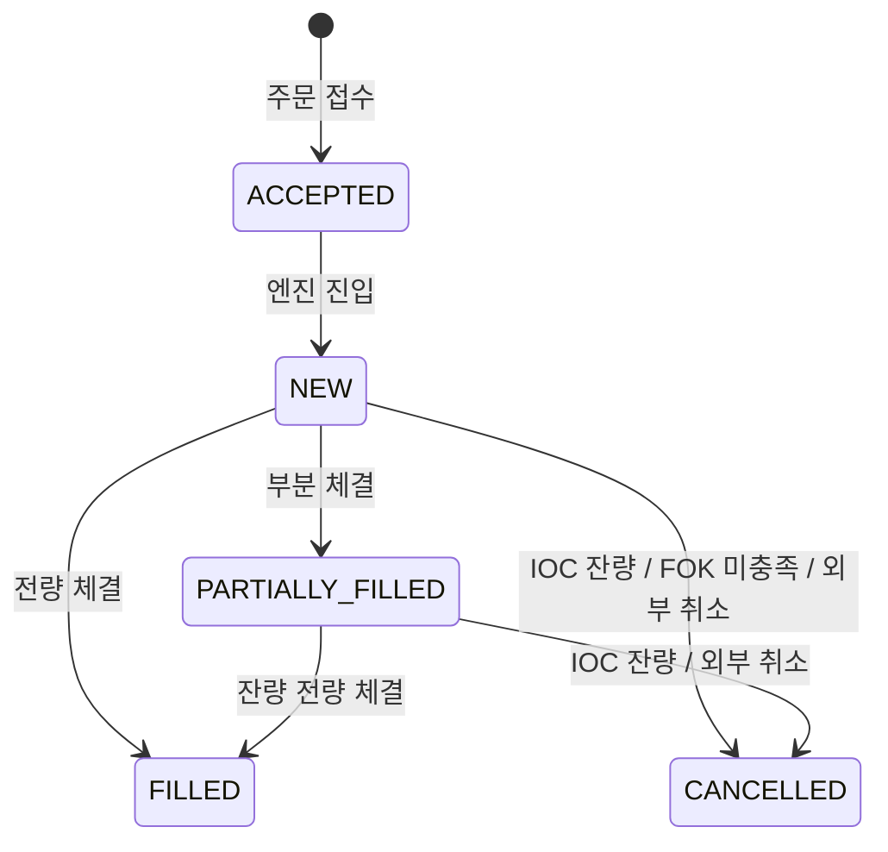

# Trading Exchange Engine - MVP Phase 3 기획서

---

## 1. 목표

MVP Phase 2로 구축한 다종목 매칭 엔진에 **주문 규칙 고도화와 운영 안전장치**를 추가한다.

Phase 3는 인프라 변경 없이 **순수 엔진 로직, 에러 처리**만 다룬다.
잔고/영속성(DB 반영)/Outbox는 Phase 4에서 다룬다.

핵심 목표는 4가지다.

1. **TIF 확장**: IOC / FOK 주문 규칙 추가
2. **MARKET BUY 완성**: `quantity`/`quoteQty` 선택 입력 기반 매칭
3. **백프레셔 표준화**: 큐 포화 시 표준 에러코드 응답

---

## 2. Phase 2 산출물 현황 (코드베이스 기준)

| 영역         | 현재 상태                                                        |
|------------|--------------------------------------------------------------|
| 엔진 모델      | 심볼별 `EngineContext`, 독립 `EngineLoop`, `thread-per-symbol`    |
| 큐          | `ArrayBlockingQueue(10_000)`, full 시 `IllegalStateException` |
| 주문 타입      | LIMIT + MARKET. TIF 없음 (GTC 고정)                              |
| MARKET BUY | `quantity` 기준 매칭. 예산 한도 없음                                   |
| 저장소        | `MemoryOrderRepository(ConcurrentHashMap)`, 참조 공유 전제         |
| 잔고         | 없음. 초과 매수/매도 차단 불가                                           |
| Outbox     | 없음                                                           |

### 2.1 Phase 2 발견된 버그

Phase 2 코드 리뷰에서 확인된 미수정 버그. Phase 3 구현 착수 전 수정한다.

| #   | 심각도      | 제목                    | 위치                                         | 현상                                                                                                                    |
|-----|----------|-----------------------|--------------------------------------------|-----------------------------------------------------------------------------------------------------------------------|
| B-1 | Critical | 고아 주문                 | `OrderCommandService.placeOrder()`         | 저장 후 엔진 제출 실패 시 `ACCEPTED` 상태로 영구 잔류 → **submit 선행 + 성공 후 in-memory 저장으로 해소**                                         |
| B-2 | High     | 클라이언트 입력 500          | `Order.create()`, `GlobalExceptionHandler` | 잘못된 `side`/`orderType` 값 또는 LIMIT에 `price=null` 시 `IllegalArgumentException`/`NullPointerException`이 핸들러 미등록으로 500 반환 |
| B-3 | High     | DELETE /orders 응답 불일치 | `OrderController.cancelOrder()`            | 취소는 비동기 처리임에도 200 OK 반환. `POST /orders`와 일관되게 202 Accepted로 변경 필요                                                     |

#### B-1 상세 — 고아 주문

```java
// OrderCommandService.java (현재)
orderRepository.save(order);                                          // ① ACCEPTED 저장
engineManager.submit(order.getSymbol(), new EngineCommand.PlaceOrder(order)); // ② 실패 가능
// ②가 UnsupportedSymbolException·IllegalStateException으로 실패하면
// ①에서 저장된 주문이 ACCEPTED 상태로 영구 잔류 (고아 주문)
```

**수정 방향**: `submit()` 선행 + 성공 후 `saveInMemory()`로 순서 변경.

#### B-2 상세 — 클라이언트 입력 500

```java
// Order.create() (현재)
Side s = Side.valueOf(side);           // 유효하지 않은 값 → IllegalArgumentException
OrderType.valueOf(orderType);          // 유효하지 않은 값 → IllegalArgumentException
new Price(price);                      // LIMIT인데 price=null → NullPointerException
```

`GlobalExceptionHandler`에 `IllegalArgumentException` / `NullPointerException` 핸들러가 없어 500으로 처리됨.

**수정 방향**: Controller 레이어 `@Valid` + `@ValidEnum`으로 입력을 검증하고 400으로 변환한다.

#### B-3 상세 — DELETE /orders 응답 불일치

취소 요청은 `EngineCommand.CancelOrder`를 큐에 넣고 반환하는 비동기 처리임에도 200 OK를 반환한다.
`POST /orders`가 202 Accepted를 반환하는 것과 불일치한다.

**수정 방향**: `DELETE /orders/{orderId}` → 202 Accepted 반환.

---

## 3. 범위

### 포함

| 구분            | 항목                                              |
|---------------|-------------------------------------------------|
| 주문 규칙         | TIF: GTC(기존) / IOC / FOK                        |
| MARKET BUY 완성 | `quantity`/`quoteQty` 선택 입력(XOR) + 매칭 규칙 분리         |
| 백프레셔          | 큐 포화 예외 → `ENGINE_BACKPRESSURE` 에러코드            |

### 제외

| 구분               | 항목              | 이관      |
|------------------|-----------------|---------|
| 잔고/홀드/정산         | 리스크 통제 도메인      | Phase 4 |
| Outbox (이벤트 내구성) | 유실 없는 이벤트 파이프라인 | Phase 4 |
| 메트릭              | 운영 관측성          | Phase 4 |

---

## 4. 핵심 의사결정

| 번호 | 항목               | 결정               | 근거                                                      |
|----|------------------|------------------|---------------------------------------------------------|
| 1  | MARKET BUY 입력 표현 | `quantity`/`quoteQty` XOR 허용 | 클라이언트 사용성(수량/예산 선택)과 모호성 제거(동시 입력 금지) 균형 |

> 계정 모델 / Outbox 발행 대상은 Phase 4 착수 전 결정 항목으로 이관한다.

---

## 5. 도메인 확장

### 5.1 TimeInForce

```java
enum TimeInForce { GTC, IOC, FOK }
```

- `GTC`(Good Till Cancelled): 기존 동작 유지. Phase 3 기본값
- `IOC`(Immediate Or Cancel): 즉시 체결 가능 수량만 체결, 잔량 즉시 취소
- `FOK`(Fill Or Kill): 전량 즉시 체결 가능할 때만 체결, 불가능하면 취소

`Order`에 `tif: TimeInForce` 필드 추가. 기존 LIMIT/MARKET 주문의 기본값은 `GTC`.

**TIF 허용 조합**

| orderType | 허용 TIF                               |
|-----------|--------------------------------------|
| LIMIT     | GTC, IOC, FOK                        |
| MARKET    | `tif` 필드 명시 시 `INVALID_REQUEST` 거부 |

MARKET 주문은 오더북에 적재되지 않으므로 TIF 선택 자체가 의미 없다.
`tif` 필드를 명시하면 클라이언트 버그로 간주하고 즉시 400으로 거부한다. 생략 시 내부적으로 IOC로 처리한다.

### 5.2 Order 모델 변경

`Order`에 두 필드를 추가한다.

```
Order (추가 필드)
  tif:      TimeInForce   // 기본값 GTC
  quoteQty: Long          // MARKET BUY(예산 모드) 전용. 그 외 null
```

MARKET BUY는 `quantity`(수량 모드) 또는 `quoteQty`(예산 모드) 중 하나만 입력한다(XOR).
`quoteQty`는 **매칭 한도(spending cap)** 역할만 한다.
잔고 검증과 홀드는 Phase 4에서 추가된다.

---

## 6. TIF 매칭 규칙

### 6.1 GTC

기존 동작과 동일. LIMIT 주문 잔량은 오더북에 적재.

### 6.2 IOC

```
placeLimitIOC(order):
    매칭 수행 (GTC 동일)
    if order.remaining > 0:
        order.cancel()   // 잔량 오더북 미적재, 즉시 취소
```

### 6.3 FOK

FOK는 **사전 충족성 검사** 방식으로 구현한다. 부분체결 후 롤백 없음.

```
placeLimitFOK(order):
    // 검사와 매칭은 엔진 단일 스레드 내에서 연속 실행 → 원자성 보장
    available = orderBook.totalAvailableQty(oppositeSide, order.price)
    if available < order.quantity:
        order.cancel()   // 체결 없이 취소
        return PlaceResult(updatedOrders=[order], trades=[])

    // 사전 검사 통과 → 일반 매칭 수행 (전량 체결 보장)
    return placeLimitGTC(order)   // 결과는 항상 FILLED
```

`OrderBook`에 `totalAvailableQty` 메서드를 추가한다.

```java
// makerSide: 체결 상대방(maker) 측, limitPrice: taker의 가격 한도
Quantity totalAvailableQty(Side makerSide, Price limitPrice)
```

> 구현 메모: Phase 3에서는 선형 스캔으로 구현한다. 오더북 깊이 증가에 따른 레이턴시는 Phase 4 성능 최적화 항목(가격대 누적 캐시 등)으로 이관한다.

| taker 방향 | makerSide | 집계 조건                            |
|----------|-----------|----------------------------------|
| BUY FOK  | SELL      | asks.price ≤ limitPrice 까지 수량 합산 |
| SELL FOK | BUY       | bids.price ≥ limitPrice 까지 수량 합산 |

### 6.4 상태 전이



---

## 7. MARKET BUY quantity/quoteQty 매칭 규칙

### 7.1 매칭 로직

MARKET BUY 입력은 다음 제약을 따른다.

- `quantity`와 `quoteQty` 중 정확히 하나만 입력 (XOR)
- 둘 다 누락 시 400 (`INVALID_REQUEST`, 필드 에러)
- 둘 다 입력 시 400 (`INVALID_REQUEST`, 필드 에러)

`quoteQty` 모드는 예산을 기준으로 최대한 매수한다.

```
placeMarketBuyOrder(order):
    remainingQuote = order.quoteQty
    executedTradeCount = 0
    while orderBook.asks not empty:
        maker = orderBook.peek(SELL)
        maxExecQty = floor(remainingQuote / maker.price)
        if maxExecQty == 0:
            break   // 남은 예산으로 최소 1단위 구매 불가
        execQty = min(maxExecQty, maker.remaining)
        // 체결 처리: trade 생성은 기존과 동일, status 전환은 remaining 기반을 사용하지 않음
        executedTradeCount += 1
        remainingQuote -= maker.price × execQty

    // 루프 종료 후 상태 확정: remaining 기반이 아니라 체결 건수 기반
    if executedTradeCount > 0:
        order.markFilledByMarketBuy()   // MARKET BUY 전용 FILLED 전환
    else:
        order.cancel()
```

`quantity` 모드는 기존 MARKET 주문과 동일하게 목표 수량(`remaining`) 기준으로 동작한다.
MARKET SELL은 Phase 2와 동일하게 `remaining` 기준으로 동작한다.

### 7.2 remaining 필드

입력 모드에 따라 `remaining` 해석이 달라진다.

- BUY + `quoteQty` 모드: base qty 목표가 없으므로 `remaining`은 항상 0
- BUY + `quantity` 모드: 기존 MARKET과 동일하게 `remaining` 감소

조회 API 해석 규칙:
- BUY + `quoteQty` 모드: `requestedQuoteQty`, `cumQuoteQty`, `cumBaseQty`로 해석
- BUY + `quantity` 모드: `requestedQty`, `cumBaseQty`, `remaining`으로 해석

BUY + `quoteQty` 모드의 미사용 예산은 내부적으로 `leftoverQuoteQty = requestedQuoteQty - cumQuoteQty`로 계산한다.
Phase 3에는 잔고/홀드가 없으므로 남은 금액은 "미사용 예산"으로만 표현하며, 별도 환불/정산 처리는 수행하지 않는다.

### 7.3 종료 시 status 정의

BUY + `quoteQty` 모드는 "예산 내 최선 매수"이므로 PARTIALLY_FILLED 상태를 두지 않는다.
예산이 일부만 소진됐더라도 1건이라도 체결됐으면 FILLED로 처리한다.

BUY + `quantity` 모드는 기존 MARKET 주문 상태 규칙(remaining 기반)을 따른다.

| 조건                         | 최종 status   |
|----------------------------|-------------|
| BUY + `quoteQty` 체결 0건       | `CANCELLED` |
| BUY + `quoteQty` 체결 1건 이상    | `FILLED`    |
| BUY + `quantity`               | 기존 MARKET 상태 규칙 적용 |

### 7.4 MARKET BUY 응답 필드

비동기 엔진 처리 모델이므로 응답 시점별 규칙을 분리한다.

- `POST /orders` 응답: 접수 결과만 반환 (`202 Accepted`, `orderId`)
- `GET /orders/{orderId}` 응답: 입력 모드에 맞는 요청 필드와 누적 체결 정보를 반환

| 필드                  | 의미                                |
|---------------------|-----------------------------------|
| `requestedQuoteQty` | 클라이언트가 요청한 예산 (`quoteQty`, 예산 모드일 때만) |
| `requestedQty`      | 클라이언트가 요청한 수량 (`quantity`, 수량 모드일 때만) |
| `cumQuoteQty`       | 실제 체결에 사용된 quote 금액 합             |
| `cumBaseQty`        | 실제 체결된 base 수량 합                  |
| `leftoverQuoteQty`  | 미사용 예산 (`requestedQuoteQty - cumQuoteQty`, 예산 모드일 때만) |
| `status`            | 모드별 규칙에 따른 최종 상태                  |

---

## 8. 백프레셔 표준화

### AS-IS

```java
// EngineLoop.java (현재)
if (!engineQueue.offer(command)) {
    throw new IllegalStateException("Engine Queue is full");  // 500 Internal Server Error로 전파
}
```

### TO-BE

```java
// EngineLoop.java (변경)
if (!engineQueue.offer(command)) {
    throw new EngineQueueFullException();   // 503 ENGINE_BACKPRESSURE 으로 매핑
}
```

`EngineQueueFullException`은 `EngineErrorCode.ENGINE_BACKPRESSURE`를 보유한 `BusinessException`으로 구현한다.

```java
// engine/exception/EngineErrorCode.java
public enum EngineErrorCode implements ErrorCode {
    ENGINE_BACKPRESSURE(
        HttpStatus.SERVICE_UNAVAILABLE,
        "ENGINE_BACKPRESSURE",
        "엔진 처리 중입니다. 잠시 후 재시도하세요."
    );
}
```

`GlobalExceptionHandler` 수정 불필요. `BusinessException` 핸들러가 `ErrorCode.status()`로 503을 자동 반환한다.

### 클라이언트 재시도와 멱등키

503을 수신한 클라이언트가 재시도하면 동일 주문이 중복 생성될 수 있다.
이를 방지하기 위해 `PlaceOrderRequest`에 선택적 `clientOrderId` 필드를 추가한다.

```json
{
  "symbol":        "BTC",
  "side":          "BUY",
  "orderType":     "LIMIT",
  "price":         50000,
  "quantity":      10,
  "clientOrderId": "my-order-001"   // 선택 필드. 클라이언트가 생성한 UUID
}
```

서버는 `clientOrderId` 기준으로 중복 요청을 감지한다.

```
POST /orders (clientOrderId=my-order-001):
    이미 처리된 clientOrderId → 기존 orderId 그대로 반환 (202)
    신규 clientOrderId → 정상 처리
```

`clientOrderId → orderId` 매핑은 Phase 3에서 in-memory(`ConcurrentHashMap`)로 유지한다.
Phase 4(영속성) 전환 시 DB로 이관한다.

---

## 9. API 변경

### 9.1 주문 요청 변경

```json
// LIMIT 주문 (tif 추가)
{
  "symbol":    "BTC",
  "side":      "BUY",
  "orderType": "LIMIT",
  "tif":       "GTC",
  "price":     50000,
  "quantity":  10
}
```

```json
// MARKET BUY (예산 모드: quoteQty)
{
  "symbol":    "BTC",
  "side":      "BUY",
  "orderType": "MARKET",
  "quoteQty":  500000
}
```

```json
// MARKET BUY (수량 모드: quantity)
{
  "symbol":    "BTC",
  "side":      "BUY",
  "orderType": "MARKET",
  "quantity":  10
}
```

```json
// MARKET SELL (기존과 동일)
{
  "symbol":    "BTC",
  "side":      "SELL",
  "orderType": "MARKET",
  "quantity":  10
}
```

- LIMIT: `tif` 생략 시 `GTC` 기본값
- MARKET: `tif` 필드 명시 시 즉시 400 거부
- MARKET BUY: `quantity`/`quoteQty` 중 정확히 하나 필수(XOR)
- MARKET SELL: `quantity` 필수. `quoteQty` 무시
- `clientOrderId`: 선택 필드. 명시 시 중복 제출 방지
- 멱등 범위(Phase 3): `clientOrderId` 단독 유일키(in-memory) 사용
- 제약: Phase 3에는 account 도메인이 없으므로 계정별 분리는 미지원
- Phase 4 전환: account 도입 후 `(accountId, clientOrderId)` 유일키로 이관

`POST /orders`는 접수 응답만 반환한다(`202 Accepted`, `orderId`).
MARKET BUY 체결 결과 필드(`requestedQuoteQty`/`requestedQty`, `cumQuoteQty`, `cumBaseQty`, `leftoverQuoteQty`)는
`GET /orders/{orderId}` 조회 응답에서 제공한다.

### 9.2 에러 코드/검증 응답 정책

| HTTP  | errorCode                       | 예외 클래스                         | 원인                      |
|-------|---------------------------------|--------------------------------|-------------------------|
| `503` | `ENGINE_BACKPRESSURE`           | `EngineQueueFullException`     | 엔진 큐 포화                 |
| `400` | `INVALID_REQUEST`               | `ConstraintValidator` (DTO 레벨) | MARKET 주문에 tif 명시       |

MARKET BUY XOR 검증(`quantity`/`quoteQty`)은 `PlaceOrderValidator`에서 처리한다.
검증 실패 응답은 신규 도메인 에러코드 추가 없이 `400 INVALID_REQUEST`(필드 에러 목록)로 반환한다.

---

## 10. 구현 단계 (권장 순서)

### Phase 3-0. Phase 2 버그 수정 (선행)

1. **B-1** `OrderCommandService.placeOrder()` — 저장과 제출 순서 뒤집기 (제출 성공 후 저장)
2. **B-2** Controller 레이어 — `Side`/`OrderType` 잘못된 값 및 LIMIT `price=null` → `@Valid` + `@ValidEnum`으로 400 처리
3. **B-3** `OrderController.cancelOrder()` — 응답 코드 200 → 202 Accepted 변경

### Phase 3-1. TIF

1. `TimeInForce` enum 추가, `Order.tif` 필드 추가 (기본값 `GTC`)
2. `OrderBook.totalAvailableQty()` 구현
3. `MatchingEngine` IOC 매칭 규칙 구현
4. `MatchingEngine` FOK 매칭 규칙 구현
5. `PlaceOrderRequest.tif` 필드 + `PlaceOrderValidator` (ConstraintValidator) 연결
6. TIF 상태 전이 단위 테스트

### Phase 3-2. MARKET BUY quantity/quoteQty + 백프레셔

1. `Order.quoteQty` 필드 추가 (nullable)
2. `MatchingEngine.placeMarketOrder()` — MARKET BUY는 `quantity`/`quoteQty` 모드로 분기
3. MARKET BUY 종료 status 규칙 구현 (7.3 정의 적용)
4. `PlaceOrderRequest.quoteQty` + `quantity` XOR 검증, MARKET `tif` 명시 검증 (`PlaceOrderValidator` 확장)
5. MARKET BUY 단위 테스트 (quoteQty 모드/quantity 모드 + XOR 검증)
6. `EngineLoop.submit()`: `IllegalStateException` → `EngineQueueFullException` 전환 (`offer()` 호출은 Phase 2에서 이미 적용됨)
7. `EngineQueueFullException` + `EngineErrorCode` 구현
8. `PlaceOrderRequest.clientOrderId` + in-memory 멱등성 처리 구현 (`clientOrderId` 단독 유일)
9. 백프레셔 + 멱등키 테스트

### Phase 3-3. B-1 마무리 검증

1. **B-1 해소 검증**: `OrderCommandService.placeOrder()` — `submit()` 선행, 성공 후 `saveInMemory()`

---

## 11. 테스트 전략

### 기능 검증

| 항목                          | 검증 방법                                                         |
|-----------------------------|---------------------------------------------------------------|
| IOC 잔량 취소                   | 부분 체결 후 remaining > 0 → CANCELLED                             |
| IOC 전량 체결                   | 유동성 충분 시 FILLED                                               |
| FOK 미충족                     | 유동성 부족 시 체결 0건 + CANCELLED                                    |
| FOK 전량 체결                   | 유동성 충분 시 FILLED                                               |
| MARKET BUY(quoteQty) 체결 성공  | 예산 소진·유동성 소진 무관, 1건 이상 → FILLED                               |
| MARKET BUY(quoteQty) 유동성 없음 | 0건 체결 → CANCELLED                                             |
| MARKET BUY(quoteQty) 잔여 예산  | `leftoverQuoteQty = requestedQuoteQty - cumQuoteQty` 일관성 검증   |
| MARKET BUY(quantity) 매칭 동작  | 기존 MARKET 주문 상태 규칙(remaining 기반)과 동일 동작                       |
| MARKET BUY 입력 XOR           | quantity/quoteQty 중 하나만 허용, 동시 입력·동시 누락은 400                  |
| MARKET tif 명시 거부            | MARKET 요청에 tif 포함 → 400 INVALID_REQUEST                       |
| 백프레셔                        | 큐 포화 유도 후 `ENGINE_BACKPRESSURE` (503) 일관 응답                   |
| 멱등키 중복 방지                   | 동일 `clientOrderId` 재시도 → 기존 orderId 반환, 주문 중복 없음              |
| B-1 해소 검증                   | `submit()` 실패 시 in-memory 저장소에 주문 미기록 확인                      |

### 회귀 검증

기존 Phase 2 테스트 전체 통과. 인프라 변경이 없으므로 테스트 환경 변경 없음.

---

## 12. 완료 기준 (Definition of Done)

1. IOC / FOK 규칙 동작 + 상태 전이 테스트 통과
2. MARKET BUY `quantity`/`quoteQty` 모드별 종료 status(7.3 정의)대로 동작
3. 큐 포화 시 `ENGINE_BACKPRESSURE` (503) 응답
4. `submit()` 실패 시 DB 미기록 (B-1 고아 주문 없음) 검증
5. 기존 Phase 2 테스트 전체 통과

---

## 13. 리스크 및 대응

| 리스크                  | 대응                                             |
|----------------------|------------------------------------------------|
| FOK 구현 오류 (부분체결 실행)  | 사전 충족성 검사 방식 고정 + 충족/미충족 경계 케이스 단위 테스트         |
| MARKET BUY status 혼동 | 7.3 정의를 구현 전 합의 후 착수                           |
| 백프레셔 중 상태 불일치        | Phase 3에 잔고 없음. Phase 4 보상 트랜잭션에서 처리           |

